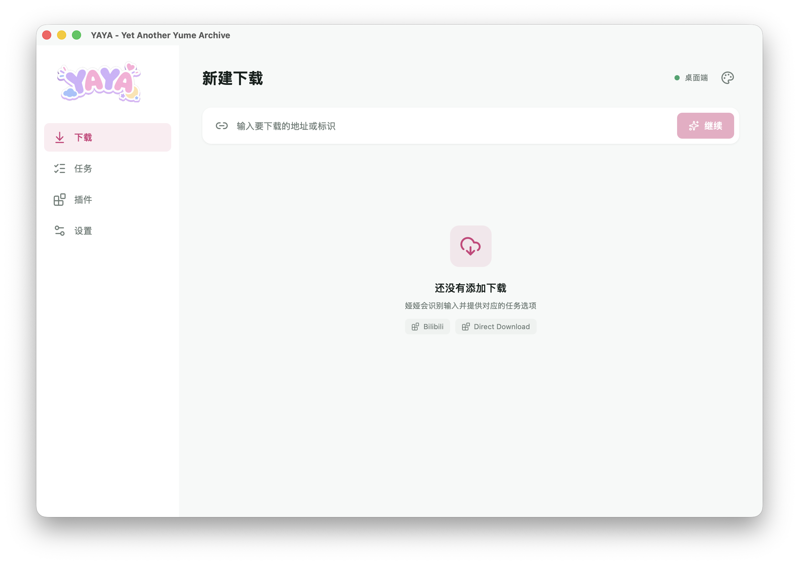
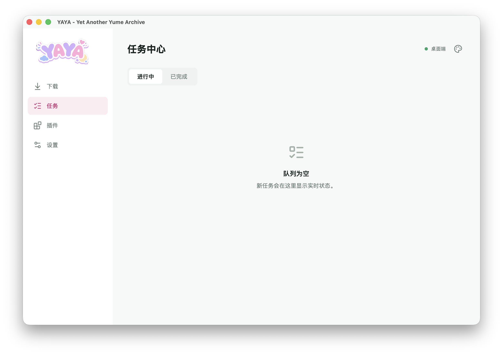
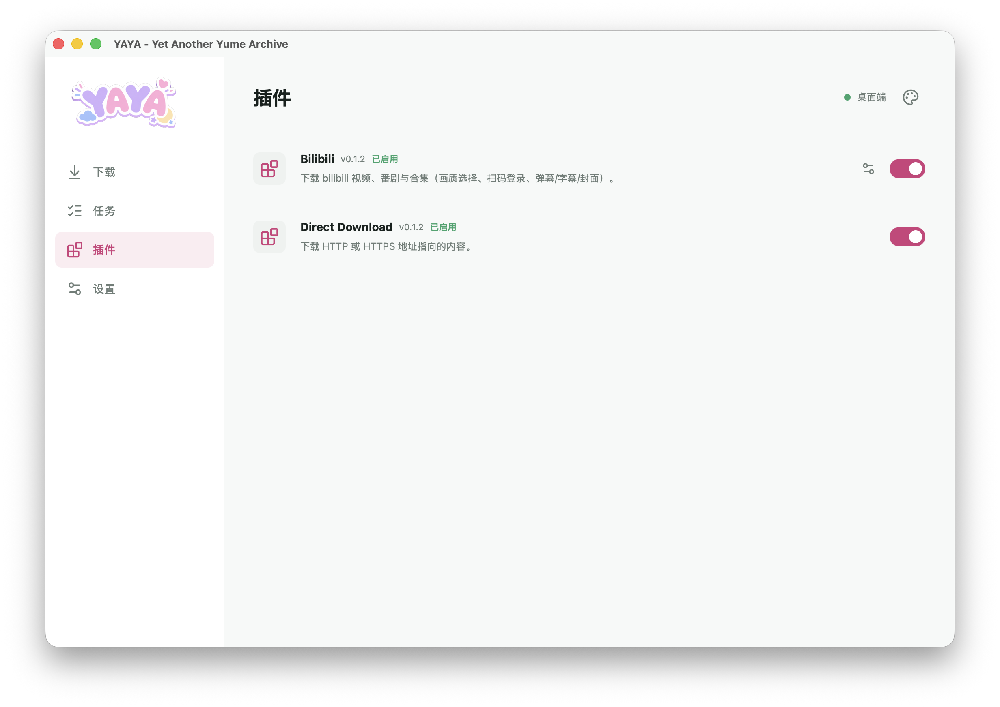
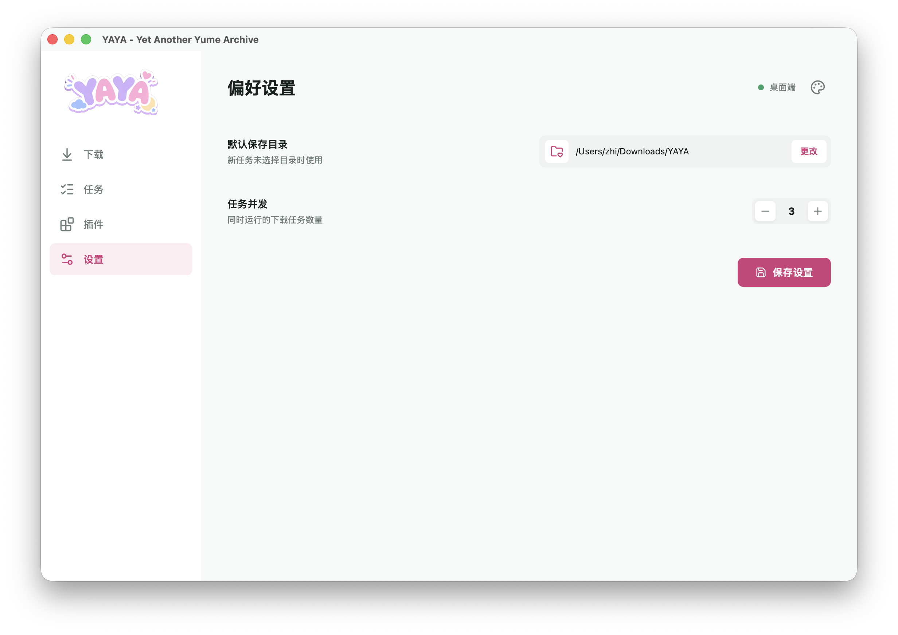

<div align="center">
  

  <h1>Yet Another Yume Archive</h1>

  <p><strong>YAYA / 娅娅</strong> · 一款面向多平台的现代化下载工具</p>

  <p>
    
    
    
    
  </p>

  <p>桌面端 · 移动端 · Web · Provider 驱动</p>
</div>

<br>



## 亮点

| | |
| --- | --- |
| **现代化交互界面**<br>基于 Vue 3 与 UnoCSS，提供响应式布局、明暗模式和可切换主题色。 | **高性能下载引擎**<br>内置 HTTP/HTTPS 多线程分片下载，支持断点续传、实时限速与文件校验。 |
| **跨平台体验**<br>覆盖 Tauri v2 桌面端、移动端应用以及轻量级 Web 服务。 | **Provider 扩展机制**<br>站点能力由独立 Provider 提供，宿主保持内容中立，扩展和隔离更清晰。 |

## 界面预览

<p align="center">
  
  
  
</p>

<p align="center">
  <sub>任务中心 · 插件管理 · 偏好设置</sub>
</p>

## 快速开始开发

### 前置要求

- Node.js `^20.19.0` 或 `>=22.12.0`
- Rust `>= 1.80`
- npm / Cargo

### 安装依赖

```bash
npm install
```

### 构建 Provider UI

```bash
npm run build:provider-ui
```

### 启动应用

macOS / Windows / Linux 桌面端：

```bash
npm run tauri dev
```

Web 版：

```bash
npm run web
```

### 运行测试

```bash
cargo test --workspace
```

## 开发与扩展

想为娅娅开发 Provider 或参与贡献，可以从这些文档开始：

- [Provider 开发者指南](docs/provider-development.md) — 编写自己的资源解析 Provider
- [Provider Protocol 规范](docs/provider-protocol.md) — Provider 与宿主间的通信协议
- [Direct Provider](providers/direct/README.md) — 官方 HTTP/HTTPS 直链下载参考实现

## License

GPL-3.0-only
